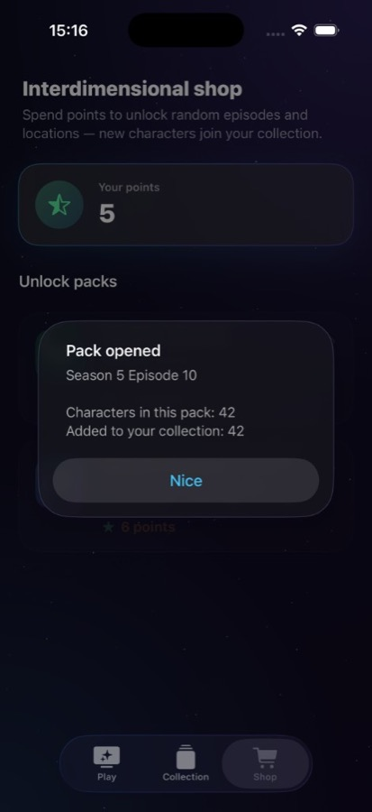
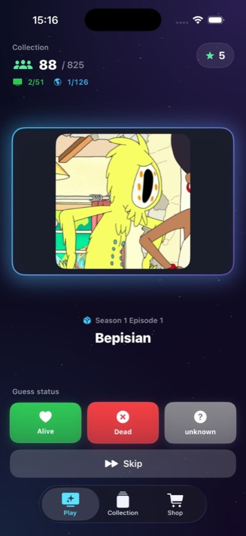
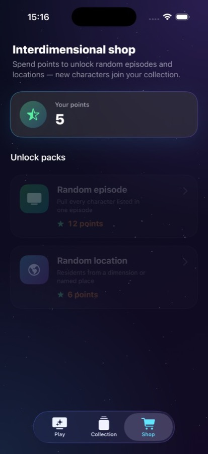

# Rick & Morty — Character Collection Game

An **iOS** game built with **SwiftUI** where you collect characters from the [Rick and Morty API](https://rickandmortyapi.com/), guess their **status** (Alive / Dead / unknown) to earn **points**, and spend points in the shop to unlock **random episodes** and **locations** and grow your roster.

---

## Screenshots


| Play | Collection | Shop |
|:--:|:--:|:--:|
|  |  |  |


---

## Features

- **Quiz loop** — Random character from your pool; correct status guess adds a point, wrong guess subtracts (minimum zero); optional **Skip**.
- **Shop** — Spend points on a **random episode** or **random location**; costs increase after each purchase; new characters are fetched from the API.
- **Collection** — Track unlocked **episodes** and **locations** (with API titles where available) and overall progress toward the API totals.
- **Persistence** — Characters, points, unlocked packs, and shop costs saved with **`UserDefaults`** (`@AppStorage`).
- **Visual feedback** — Full-screen pulse (green/red) on correct/incorrect guesses; dark “portal” themed UI.

---

## Tech stack

| | |
|--|--|
| **UI** | SwiftUI |
| **Networking** | Alamofire + Combine |
| **API** | `https://rickandmortyapi.com/api` |
| **Minimum target** | iOS (see Xcode project) |

---

## Requirements

- **Xcode** (recent version recommended)
- **Swift Package Manager** — resolves **Alamofire** on open

---

## Getting started

1. Clone the repository:
   ```bash
   git clone https://github.com/werter08/Rick-MortyGame.git
   cd Rick-MortyGame
   ```
2. Open **`Rick&MortyGame.xcodeproj`** in Xcode.
3. Wait for Swift packages to resolve.
4. Select an **iPhone** simulator or device and press **Run** (`⌘ + R`).

---

## Project structure (overview)

```
Rick&MortyGame/
├── Rick_MortyGameApp.swift    # App entry
├── ContentView.swift          # Tab bar (Play, Collection, Shop)
├── GameView.swift             # Guessing UI
├── CollectionView.swift       # Episodes & locations collection
├── ShopView.swift             # Purchases
├── ViewModel.swift            # Game logic & API orchestration
├── AppConfiguration.swift     # Persisted state
├── Theme.swift                # Shared styling & background
├── Network/                   # Endpoints & API client
└── Extension/                 # String / Array / Set helpers
```

---

## API & data

Character, episode, and location data come from the **Rick and Morty API**. This project is a fan-made educational demo and is **not** affiliated with or endorsed by the show’s rights holders.

---

## Credits

The **user interface** (layout, styling, theme, and related SwiftUI structure) was designed and implemented with assistance from an **AI coding assistant** (e.g. Cursor). Game logic, networking, and project integration remain under your control as the developer—this note is for transparency on GitHub.

---

## License

Add a `LICENSE` file if you want to specify terms (e.g. MIT). Until then, all rights remain with the author unless you state otherwise.

---

<p align="center">
  <sub>Built with SwiftUI · UI assisted by AI · Rick and Morty © Adult Swim — fan project only</sub>
</p>
